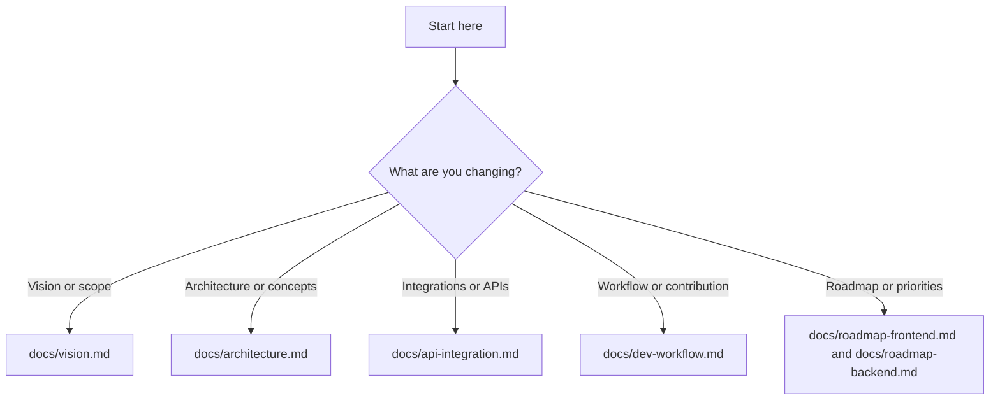

# Copilot Instructions – EVA Station

## Overview

This repository exists to **centralize information for EVA token holders**, with an initial focus on real-time conversion and pricing.

**Goal:**

- Provide a universal conversion panel: BTC <-> Satoshi <-> USD <-> BRL <-> EVA
- Show EVA price in real time (USD and BRL)
- Convert EVA to Satoshis and BTC in real time
- Reduce context switching for frequent EVA buyers/holders

**User:** Anyone who is a frequent EVA buyer and analyst

**Out of scope for now:** Tokenomics (planned for a future phase)

## 🎯 Problem Being Solved

The user currently needs to:

1. Open Arbiscan manually
2. Do conversion calculations across currencies
3. Check multiple sources to understand token metrics
4. Repeat this process every time they want to analyze the token

**Solution:** Centralize everything in a single dashboard with real-time updates.

## 🔧 Technical Stack

```json
{
  "framework": "Next.js 14",
  "router": "App Router",
  "language": "TypeScript",
  "styling": "Tailwind CSS",
  "blockchain": "Ethers.js ou Viem",
  "deployment": "Vercel",
  "apis": ["Arbitrum RPC", "CoinGecko API", "AwesomeAPI (BRL)", "Arbiscan API"]
}
```

## 📊 EVA Token Information

```typescript
const EVA_TOKEN = {
  name: "Ever Value Coin",
  symbol: "EVA",
  address: "0x45D9831d8751B2325f3DBf48db748723726e1C8c",
  network: "Arbitrum One",
  chainId: 42161,
  decimals: 18, // Verify via contract
  type: "ERC-20",
};
```

---

## Repository Structure

This repository prioritizes **documentation-first design**.

- `docs/`
  Contains markdown files describing:
  - Vision
  - Architecture
  - Writing and naming conventions

- `.github/`
  Defines collaboration standards:
  - Copilot / agent instructions
  - Issue templates
  - Pull request templates
  - Contribution guidelines

- Root configuration files
  General formatting and hygiene rules (editor, ignores), intentionally minimal and stack-agnostic.

No source code structure is assumed.

---

## Decision Tree (Docs)



Quick links by decision level:

- Vision and scope: [docs/vision.md](docs/vision.md)
- Architecture and concepts: [docs/architecture.md](docs/architecture.md)
- Integrations and APIs: [docs/api-integration.md](docs/api-integration.md)
- Workflow and contribution: [docs/dev-workflow.md](docs/dev-workflow.md)
- Roadmap and priorities: [docs/roadmap-frontend.md](docs/roadmap-frontend.md) and [docs/roadmap-backend.md](docs/roadmap-backend.md)
