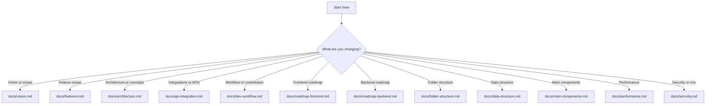

# Copilot Instructions – EVA Station

## Overview

See [README.md](../README.md) for the project overview, goals, target user, and out-of-scope items.

---

## AI Brief

Short context for AI agents. For full details, use the canonical docs linked below.

### Project Summary

- Product: EVA Station, on-chain analysis dashboard for EVA (Arbitrum).
- Goal: real-time conversion and pricing with phased metrics expansion.
- Stack: Next.js 14, TypeScript, Tailwind, Ethers/Viem.

### Developer Context

- Frontend: React/Next/TypeScript experience.
- Backend/Web3: needs guidance and step-by-step explanations.

### Guidance for Suggestions

- Prefer TypeScript and custom hooks for reusable logic.
- Keep API calls in clients; UI components should not fetch.
- Include error handling and loading states.

---

## Decision Tree (Docs)

Quick links by decision level:

- Vision and scope: [docs/vision.md](../docs/vision.md)
- Feature scope: [docs/features.md](../docs/features.md)
- Architecture and concepts: [docs/architecture.md](../docs/architecture.md)
- Integrations and APIs: [docs/api-integration.md](../docs/api-integration.md)
- Workflow and contribution: [docs/dev-workflow.md](../docs/dev-workflow.md)
- Folder structure: [docs/folder-structure.md](../docs/folder-structure.md)
- Data structure: [docs/data-structure.md](../docs/data-structure.md)
- Main components: [docs/main-components.md](../docs/main-components.md)
- Performance: [docs/performance.md](../docs/performance.md)
- Security and env: [docs/security.md](../docs/security.md)

- Frontend roadmap: [docs/roadmap-frontend.md](../docs/roadmap-frontend.md)
- Backend roadmap: [docs/roadmap-backend.md](../docs/roadmap-backend.md)
