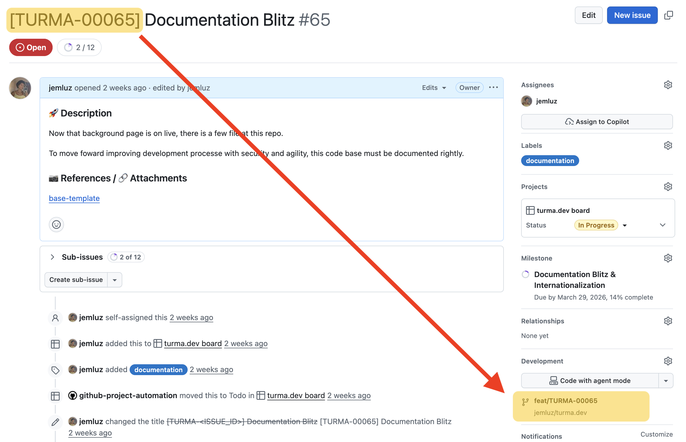
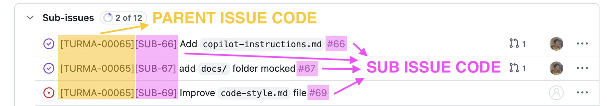
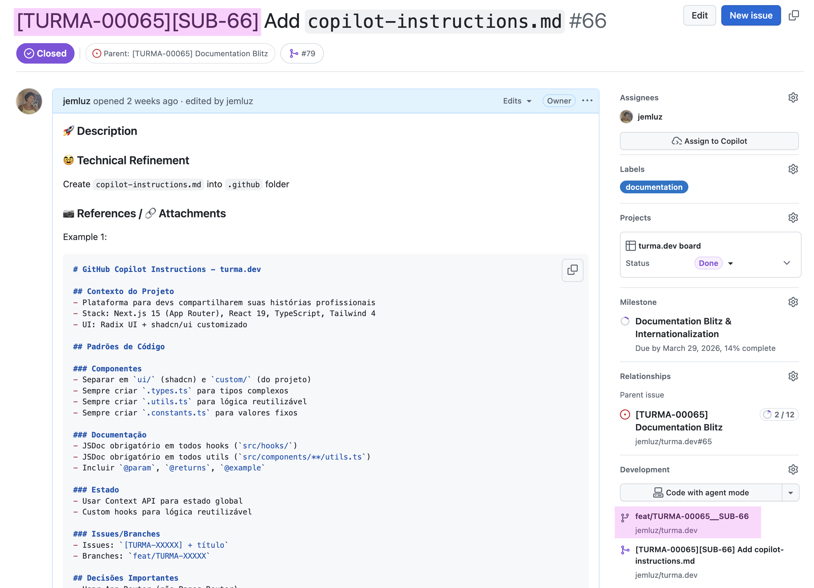
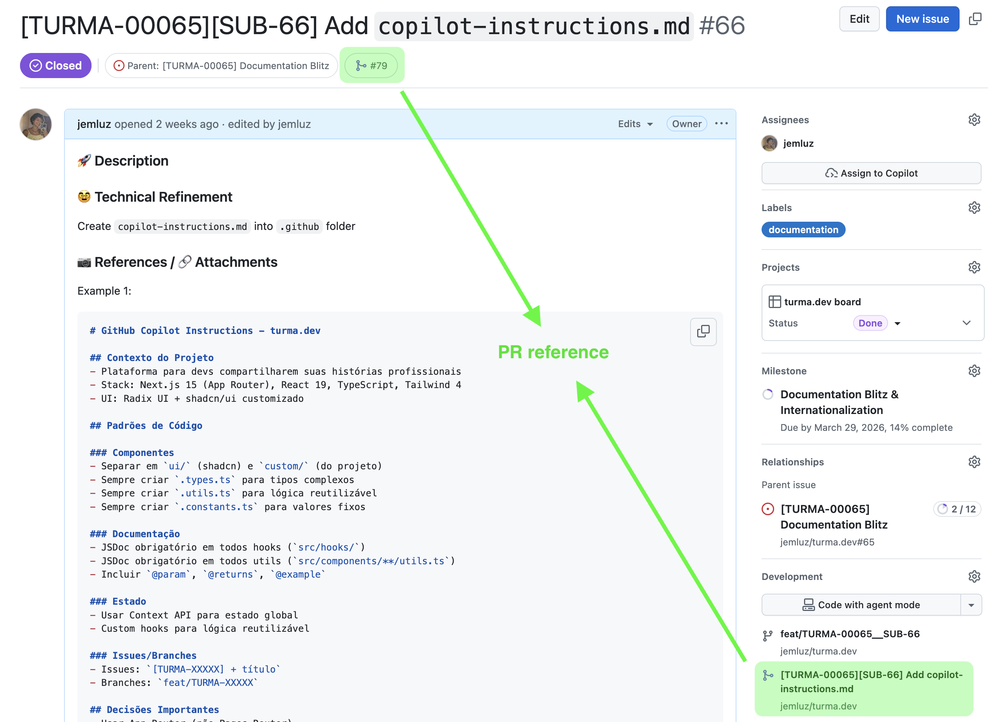

## Setup

- run `nvm install` to get the npm version defined by `.nvmrc`
- run `nvm alias default lts/{version_name}` if you want to set that npm version as default

### Code Formatting

- There is an `.editorconfig` file to set what is expected as code formatting standards
- Prettier was installed here so you can use the scripts `npm run lint:check` and `npm run lint:fix` to solve formatting issues

## Task tracking and continuous delivery

The main goal with this workflow is delivery small and continuous, so if a issue is getting a large scope, sub issues must be created to keep delivery process small and continuous.

Also it is important be able to track any [pull requests - commit - branch - subissue - issue - milestone - release] relations. To allow that, follow the patterns below.

The images attached at this section is just examples (from another project - turma.dev)

### Release

A release is a functional version with new features/fixes, usually nesting one or more milestones inside itself.

### Milestone

A milestone is a package of one or more issues (related both), usually will define important archievements to project.

### (Main/Parent) Issues

A issue is a key point to done into a milestone. It could have sub issues or not.
Every issue starts creating a new branch from dev branch, and after done, ends with a Pull Request from that issue branch pointing to dev back.
The PR merge type must be a squash.

**Creating/naming a issue**

1. Before start any work, you should create a issue, this will generate the issue number.
2. Set the issue title rightly, use the pattern `[EVAST-XXXXX] + issue_title`. The generated issue number (#X...) should fill the `XXXXX` part.

- As example: if the issue is `#86` the code will be `[EVAST-00086]`
- As another: if is `#3` will be `[EVAST-00003]`

**Creating/naming a (main/parent) issue branch:**

3. Follow the pattern `feat/EVAST-XXXXX` to create branchs based on the issue that was opened

**Commits at (main/parent) issue branches:**

4. Commits at issue branch should follow [Semantic Commit Messages](https://gist.github.com/joshbuchea/6f47e86d2510bce28f8e7f42ae84c716) pattern.

- Use this format directly `type(IXXXXX): commit message description whatever`
- Or if there is a PR from some sub issue, set the squash merge title to `[EVAST-XXXXX] + [SUB-YY] + title (PR #ZZ)` (#ZZ is PR number)
- See more details about at PRs section

### Sub issues

**Creating/naming a sub issue**

5. If the issue is too big, you should create sub issues to divide the work in small parts. Each sub issue will generate it own number too.
6. Set the sub issue title rightly, use the pattern `[EVAST-XXXXX] + [SUB-YY] + title`. The generated sub issue number (#Y...) should fill the `YY` part.

- As example: if the issue is `#86` and sub issue is `#89`, the code will be `[EVAST-00086][SUB-89]`
- As another: if is `#3` and sub issue is `#4`, the code will be `[EVAST-00003][SUB-4]`

**Creating/naming a sub issue branch:**

7. Follow the pattern `feat/EVAST-XXXXX__SUB-YY` to create branchs based on the sub issue that was opened

### Pull Request (PR)

Every PR is end of a issue or sub issue.
The PR should be referenced at it corresponding issue/subissue.

**Which branch to point:**

- Issues branches should point to dev branch.
- Sub issues branches should point to their parent issue branch.

**PR merge type:**

All PR should be of squash merge type. Avoid other types.

**PR merge commit title and description:**

- IF is a PR `from issue` branch `to dev branch`
  -- the title must be: `[EVAST-XXXXX] + title PR (#ZZ)` (#ZZ is PR number)
  -- the description should start with `more details at #XX`, and followed by previous branch's commit messages (no need to edit)

- IF is a PR `from sub issue` branch `to parent issue` branch
  -- the title must be: `[EVAST-XXXXX][SUB-YY] + title (PR #ZZ)` (#ZZ is PR number)
  -- the description should start with `more details at #XX`, and followed by previous branch's commit messages (no need to edit)

Put example images here

### Resume

**For issues**
**Title**: `[EVAST-XXXXX] + title` | **Branch naming**: `feat/EVAST-XXXXX` | **Commits format**: `type(IXXXXX): commit message description whatever`

**For Sub Issues**
**Title**: `[EVAST-XXXXX] + [SUB-YY] + title` | **Branch naming**: `feat/EVAST-XXXXX__SUB-YY` | **Commits format**: `type(IXXXXX__SYY): commit message description whatever`
